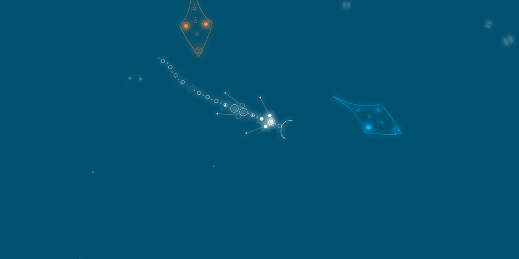

# :trophy: Classement du mini-jeu "*C'est quoi le jeu ?"*

But du jeu : trouver de quel jeu provient une capture d'écran
> Mini-jeu se déroulant sur un serveur Discord

## ✨ Mini jeu maintenant accessible depuis la nouvelle version du site ➡️ **[C'est quoi le jeu ?](https://ssstuart.net/CQLJ/)**

# Exemples

